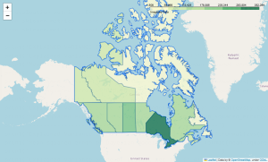

<h1> Data Engineer with Kasra </h1>

Kasra Heidarinezhad has achieved Bachelor and Master's degree in Computer Engineering from the I. Azad University. He is an accomplished Data engineer, having developed effective solutions to challenging data-related problems. His expertise includes Big Data, Machine Learning, and Predictive Analytics, and he is well-versed in various programming languages and software tools which aid in the analysis and engineering of data. Kasra has been involved in data-driven projects in the financial services, retail, gas-oil, and energy industries. He has a comprehensive knowledge of the data lifecycle, from acquisition, cleaning, and analysis to visualization. Additionally, Kasra is highly capable of designing data pipelines, data warehouses, and machine learning models.
***
## Sample Projects

### Data Analysis of Canada Immigration Information

Dataset of this project belong to Immigration, Refugees and Citizenship Canada. It is the department of the Government of Canada with responsibility for matters dealing with immigration to Canada, refugees, and Canadian citizenship.The department was established in 1994 following a reorganization.

!📢[Coming Soon!](https://www.google.com)
 
### An EDA Case Study: Real Estate in Metro Vancouver, BC, Canada
In this project, we have scraped, prepared, and analyzed the housing prices in British Columbia. We have also done some visualizations in the real estate market and proposed some ML methods for predicting housing prices.
Check out the website here

!📢 [Check out it here!](https://share.streamlit.io/kasra.Heidarinezhad/VancouverRS/app.py)

****

## Author
* Kasra Heidarinezhad
* [Website](https://kasraheidarinezhad-personalwebstreamlit-app-0ipy2u.streamlit.app)
* Github: https://www.Github.com/kasraheidarinezhad
* Linkedin: https://www.Linkedin.com/kasra-heidarinezhad
* Email: Kasra [dot] Heidarinezhad at gmail.com

## Feedback
All feedbacks and comments welcome! Email me now.