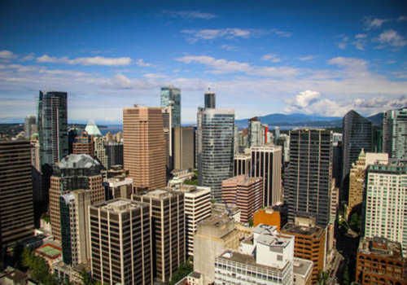
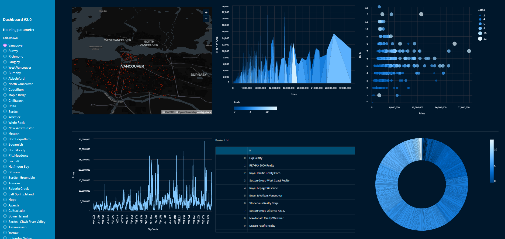

## Sample Project

### An EDA Case Study: Real Estate in Metro Vancouver, BC, Canada
In this project, we have scraped, prepared, and analyzed the housing prices in British Columbia. We have also done some visualizations in the real estate market and proposed some ML methods for predicting housing prices with Python. This project includes:
* **Section 1** Introduction
* **Section 2** Creating data source with Web Scraping, data cleaning, missing values and outliers
* **Section 3** Data visualization (with Python libraries and Tableau)
* **Section 4** Database, SQL and Query
* **Section 5** Statistical data modeling (LRM using sklearn library), Handle of big data workloads with Apache Spark
* **Section 6** Building a data pipeline with Google Dataflow and Apache Beam

!📢 [Check out it here!](https://drive.google.com/file/d/1fOaFymV96A8REwk2QDubnTWdYC8ZLB4w/view)

#### A Visualization Dashboard, Housing Price in Metro Vancouver, BC, Canada
In this part we created a responsive dashboard to visualization previous project, it includes map, line-chart, histogram and... categorized by _town_ in province.
!📢 [Check out it here!](https://share.streamlit.io/kasra.Heidarinezhad/VancouverRS/app.py)

****

##### Contact me:
* Github: https://www.Github.com/kasraheidarinezhad
* Linkedin: https://www.Linkedin.com/kasra-heidarinezhad
* Email: Kasra [dot] Heidarinezhad at gmail.com

##### Feedback
All feedbacks and comments welcome! Email me now.

##### About the Author
_Kasra Heidarinezhad_ has achieved Bachelor and Master's degree in Computer Engineering from the I. Azad University. He is an accomplished Data engineer, having developed effective solutions to challenging data-related problems. His expertise includes Big Data, Machine Learning, and Predictive Analytics, and he is well-versed in various programming languages and software tools which aid in the analysis and engineering of data. Kasra has been involved in data-driven projects in the financial services, retail, gas-oil, and energy industries. He has a comprehensive knowledge of the data lifecycle, from acquisition, cleaning, and analysis to visualization. Additionally, Kasra is highly capable of designing data pipelines, data warehouses, and machine learning models.

        '''''
        dfr = rdf.query(' -121 > longitude > -124')
        dfr = rdf.query('48 < latitude < 51')

        st.pydeck_chart(pdk.Deck(
        #map_style = "mapbox://styles/mapbox/streets-v12" ,#None,
        initial_view_state=pdk.ViewState(
        latitude=dfr.latitude.mean(), longitude=dfr.longitude.mean(),
        zoom=11, pitch=50,
        ),
        layers=[
        pdk.Layer(
           'ScatterplotLayer', #'HexagonLayer',
           data=dfr,
           get_position='[longitude , latitude]',
           radius=50, elevation_scale=14, elevation_range=[0, 500],
           pickable=True, extruded=True,
            ),
        pdk.Layer(
            'ScatterplotLayer',
            data=dfr,
            get_position='[longitude , latitude]',
            get_color='[200, 30, 0, 160]', get_radius=50,
            ), ],
        ))
        '''